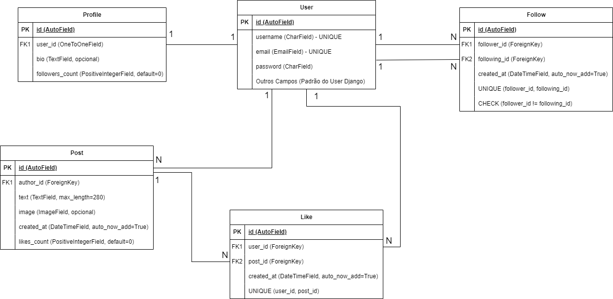
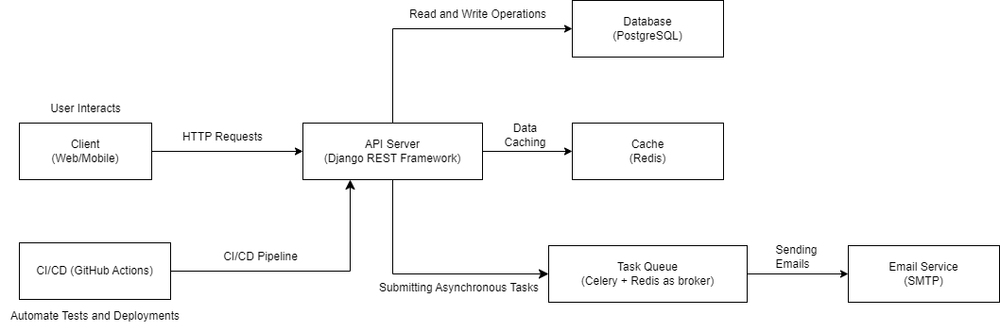

[🇺🇸 English Version](#-english-version) | [🇧🇷 Versão em Português](#-versão-em-português)

## 🇺🇸 English Version

# 🐦 Mini-Twitter API

This project implements a RESTful API for a simple social media platform similar to Twitter. The API allows users to register, authenticate, post, like posts, follow other users, and view a feed with posts from followed users.

## 📑 Table of Contents

- [🛠️ Technologies Used](#-technologies-used)
- [✨ Features](#-features)
- [📋 Prerequisites](#-prerequisites)
- [🚀 Setup and Execution](#-setup-and-execution)
- [✅ Testing](#-testing)
- [📄 API Documentation](#-api-documentation)
- [📊 Diagrams](#-diagrams)
- [🐳 Useful Docker Commands](#-useful-docker-commands)
- [📧 Support](#-support)
- [👤 Author](#-author)

## 🛠️ Technologies Used

- **Language:** Python 3.12.7
- **Framework:** Django REST Framework
- **Database:** PostgreSQL
- **Authentication:** JWT (JSON Web Tokens)
- **Cache:** Redis
- **Asynchronous Queues:** Celery
- **Containerization:** Docker and Docker Compose
- **API Documentation:** Swagger
- **Testing:** Pytest
- **CI/CD:** GitHub Actions

## ✨ Features

- User registration and authentication using JWT
- Follow and unfollow other users
- Create, edit, and delete posts with text and images
- Like and unlike posts
- View a personalized feed with posts from followed users
- Pagination of feed posts
- Search for posts by keyword or username
- User feed caching using Redis
- Rate limiting to prevent excessive requests
- Email notifications when following a user
- Complete code coverage with Pytest
- CI/CD pipeline with GitHub Actions
- API documentation generated with Swagger

## 📋 Prerequisites

Before starting, make sure you have the following tools installed:

- Docker
- Docker Compose
- Python 3.12.7

## 🚀 Setup and Execution

### 1. Clone the Repository

```bash
git clone https://github.com/your_username/mini-twitter.git
cd mini-twitter
```

### 2. Configure Environment Variables

Create a `.env` file in the project root with the following variables:

```env
SECRET_KEY=your_secret_key
DB_NAME=database_name
DB_USER=database_user
DB_PASSWORD=database_password
DB_HOST=db
DB_PORT=5432
REDIS_HOST=redis
EMAIL_HOST=smtp.example.com
EMAIL_PORT=587
EMAIL_HOST_USER=your_email@example.com
EMAIL_HOST_PASSWORD=your_email_password
EMAIL_USE_TLS=True
DEFAULT_FROM_EMAIL=your_email@example.com
```

**Notes:**

- **SECRET_KEY:** A secret key for your Django instance. You can generate one using online tools or Django commands.
- **EMAIL\_\***: You can use an email service like **Mailtrap** for testing email sending in the development environment.

### 3. Build and Start Containers

In the terminal, run:

```bash
docker-compose up --build
```

This command will:

- Build the required Docker images.
- Start the services defined in `docker-compose.yml` (web, db, redis, celery).

### 4. Apply Migrations and Create Superuser

In a new terminal, run:

```bash
docker-compose exec web python manage.py migrate
docker-compose exec web python manage.py createsuperuser
```

- **Migrate the Database:** Applies migrations to create the necessary tables in the database.
- **Create Superuser:** Creates an admin user to access the Django admin panel.

### 5. Access the Application

- **API:** [http://localhost:8000/api/](http://localhost:8000/api/)
- **Swagger Documentation:** [http://localhost:8000/swagger/](http://localhost:8000/swagger/)
- **Django Admin:** [http://localhost:8000/admin/](http://localhost:8000/admin/) (if superuser was created)

## ✅ Testing

To run the tests with code coverage, use the `test` service defined in `docker-compose.yml`:

```bash
docker-compose run test
```

This command will:

- Run the tests defined in the `api/tests/` folder using **pytest**.
- Generate an HTML coverage report in the `htmlcov/` directory.

### View Coverage Report

You can open the `htmlcov/index.html` file in a browser to see the detailed report.

```bash
xdg-open htmlcov/index.html
```

**Note:** The command above works on Linux. On Windows or macOS, open the file manually or use the appropriate command.

## 📄 API Documentation

The API documentation is available via Swagger at:

[http://localhost:8000/swagger/](http://localhost:8000/swagger/)

This documentation allows you to see all available endpoints, methods, parameters, and data models. Through the Swagger interface, you can also test requests directly in the browser.

## 📊 Diagrams

### 📌 Entity-Relationship Diagram (ERD)



**Description:** The ERD diagram represents the database schema, showing the entities (models) and their relationships. In the diagram, the UNIQUE constraint ensures that values in a column (or combination of columns) are unique, while the CHECK constraint ensures that the data meets specific conditions, such as preventing a user from following themselves.

### 🖥️ Architecture Diagram



**Description:** The architecture diagram illustrates the main system components and how they interact, including client, API, database, cache, task queue, and CI/CD.

## 📦 CI/CD

The project uses **GitHub Actions** for continuous integration and continuous delivery (CI/CD). On each push or pull request to the `main` or `master` branches, automated tests run to ensure code integrity.

The GitHub Actions workflow is defined in the `.github/workflows/ci.yml` file.

## 🐳 Useful Docker Commands

- To restart the project: `docker-compose restart`
- To stop the services: `docker-compose down`
- To access the Django container: `docker-compose exec web bash`

## 📧 Support

For any questions or issues, contact [wendell.cmd@gmail.com](mailto:wendell.cmd@gmail.com).

## 👤 Author

- **Wendell Araújo** - [LinkedIn](https://www.linkedin.com/in/wendelloaraujo/) - wendell.cmd@gmail.com

---

[🇺🇸 English Version](#english-version) | [🇧🇷 Versão em Português](#versão-em-português)
## 🇧🇷 Versão em Português

# 🐦 Mini-Twitter API

Este projeto implementa uma API RESTful para uma plataforma de mídia social simples, semelhante ao Twitter. A API permite que os usuários registrem-se, autentiquem-se, publiquem, curtam postagens, sigam outros usuários e vejam um feed com postagens de usuários que seguem.

## 📑 Índice

- [🛠️ Tecnologias Utilizadas](#️-tecnologias-utilizadas)
- [✨ Funcionalidades](#-funcionalidades)
- [📋 Pré-requisitos](#-pré-requisitos)
- [🚀 Configuração e Execução](#-configuração-e-execução)
- [✅ Testes](#-testes)
- [📄 Documentação da API](#-documentação-da-api)
- [📊 Diagramas](#-diagramas)
- [🐳 Comandos Úteis do Docker](#-comandos-úteis-do-Docker)
- [📧 Suporte](#-suporte)
- [👤 Autor](#-autor)

## 🛠️ Tecnologias Utilizadas

- **Linguagem:** Python 3.12.7
- **Framework:** Django REST Framework
- **Banco de Dados:** PostgreSQL
- **Autenticação:** JWT (JSON Web Tokens)
- **Cache:** Redis
- **Filas Assíncronas:** Celery
- **Conteinerização:** Docker e Docker Compose
- **Documentação da API:** Swagger
- **Testes:** Pytest
- **CI/CD:** GitHub Actions

## ✨ Funcionalidades

- Registro e autenticação de usuários usando JWT
- Seguir e deixar de seguir outros usuários
- Criação, edição e exclusão de posts com texto e imagem
- Curtir e descurtir posts
- Visualização de um feed personalizado com posts dos usuários seguidos
- Paginação dos posts no feed
- Busca de posts por palavra-chave ou nome de usuário
- Cache do feed do usuário usando Redis
- Restrição de requisições para evitar excesso de acesso (limitação de taxa)
- Envio de notificações por email ao seguir um usuário
- Cobertura completa de código de testes com Pytest
- Pipeline de CI/CD com GitHub Actions
- Documentação da API gerada com Swagger

## 📋 Pré-requisitos

Antes de iniciar, certifique-se de ter as seguintes ferramentas instaladas:

- Docker
- Docker Compose
- Python 3.12.7

## 🚀 Configuração e Execução

### 1. Clonar o Repositório

```bash
git clone https://github.com/seu_usuario/mini-twitter.git
cd mini-twitter
```

### 2. Configurar Variáveis de Ambiente

Crie um arquivo `.env` na raiz do projeto com as seguintes variáveis:

```env
SECRET_KEY=sua_chave_secreta
DB_NAME=nome_do_banco
DB_USER=usuario_do_banco
DB_PASSWORD=senha_do_banco
DB_HOST=db
DB_PORT=5432
REDIS_HOST=redis
EMAIL_HOST=smtp.example.com
EMAIL_PORT=587
EMAIL_HOST_USER=seu_email@example.com
EMAIL_HOST_PASSWORD=sua_senha_de_email
EMAIL_USE_TLS=True
DEFAULT_FROM_EMAIL=seu_email@example.com
```

**Notas:**

- **SECRET_KEY:** Uma chave secreta para sua instância do Django. Você pode gerar uma usando ferramentas online ou comandos do Django.
- **EMAIL\_\***: Você pode usar um serviço de email como o **Mailtrap** para testes de envio de email em ambiente de desenvolvimento.

### 3. Construir e Iniciar os Containers

No terminal, execute:

```bash
docker-compose up --build
```

Este comando irá:

- Construir as imagens Docker necessárias.
- Iniciar os serviços definidos no `docker-compose.yml` (web, db, redis, celery).

### 4. Aplicar Migrações e Criar Superusuário

Em um novo terminal, execute:

```bash
docker-compose exec web python manage.py migrate
docker-compose exec web python manage.py createsuperuser
```

- **Migrar o Banco de Dados:** Aplica as migrações para criar as tabelas necessárias no banco de dados.
- **Criar Superusuário:** Cria um usuário administrador para acessar o painel de administração do Django.

### 5. Acessar a Aplicação

- **API:** [http://localhost:8000/api/](http://localhost:8000/api/)
- **Documentação Swagger:** [http://localhost:8000/swagger/](http://localhost:8000/swagger/)
- **Admin Django:** [http://localhost:8000/admin/](http://localhost:8000/admin/) (se o superusuário foi criado)

## ✅ Testes

Para executar os testes com cobertura de código, use o serviço `test` definido no `docker-compose.yml`:

```bash
docker-compose run test
```

Este comando irá:

- Executar os testes definidos na pasta `api/tests/` usando o **pytest**.
- Gerar um relatório de cobertura em HTML no diretório `htmlcov/`.

### Visualizar o Relatório de Cobertura

Você pode abrir o arquivo `htmlcov/index.html` em um navegador para visualizar o relatório detalhado.

```bash
xdg-open htmlcov/index.html
```

**Nota:** O comando acima funciona no Linux. No Windows ou macOS, abra o arquivo manualmente ou use o comando apropriado.

## 📄 Documentação da API

A documentação da API está disponível via Swagger no endpoint:

[http://localhost:8000/swagger/](http://localhost:8000/swagger/)

Nesta documentação, você pode visualizar todos os endpoints disponíveis, seus métodos, parâmetros e modelos de dados. Através da interface Swagger, você também pode testar as requisições diretamente no navegador.

## 📊 Diagramas

### 📌 Diagrama Entidade-Relacionamento (ERD)


**Descrição:** O diagrama ERD representa o esquema do banco de dados, mostrando as entidades (modelos) e os relacionamentos entre elas. No diagrama, a restrição UNIQUE garante que valores em uma coluna (ou combinação de colunas) sejam únicos, enquanto a restrição CHECK assegura que os dados atendam a condições específicas, como impedir que um usuário siga a si mesmo.

### 🖥️ Diagrama de Arquitetura


**Descrição:** O diagrama de arquitetura ilustra os componentes principais do sistema e como eles interagem entre si, incluindo o cliente, API, banco de dados, cache, fila de tarefas e CI/CD.

## 📦 CI/CD

O projeto utiliza o **GitHub Actions** para integração contínua e entrega contínua (CI/CD). A cada push ou pull request nas branches `main` ou `master`, os testes automatizados são executados para garantir a integridade do código.

O workflow do GitHub Actions está definido no arquivo `.github/workflows/ci.yml`.

## 🐳 Comandos Úteis do Docker

- Para reiniciar o projeto: `docker-compose restart`
- Para parar os serviços: `docker-compose down`
- Para acessar o contêiner do Django: `docker-compose exec web bash`

## 📧 Suporte

Para qualquer dúvida ou problema, entre em contato em [wendell.cmd@gmail.com](mailto:wendell.cmd@gmail.com).

## 👤 Autor

- **Wendell Araújo** - [LinkedIn](https://www.linkedin.com/in/wendelloaraujo/) - wendell.cmd@gmail.com

---